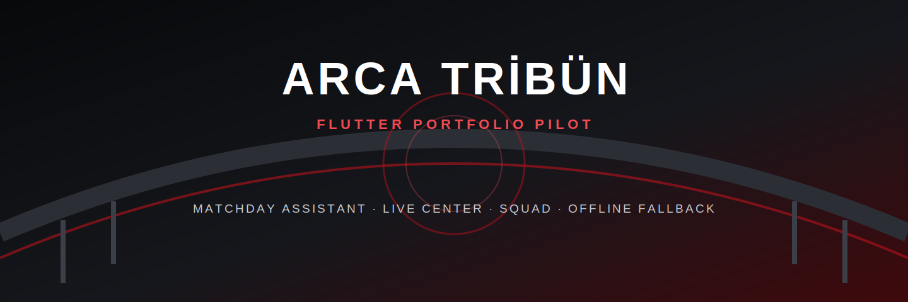
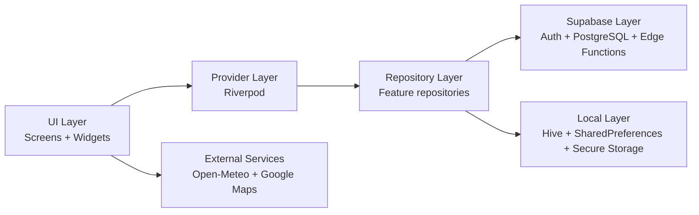

<p align="center">
  
</p>

<p align="center">
  <a href="https://flutter.dev"></a>
  <a href="https://dart.dev"></a>
  <a href="https://riverpod.dev"></a>
  <a href="https://supabase.com"></a>
  
</p>

# ARCA TRİBÜN

ARCA TRİBÜN, Arca Çorum FK bağlamında tasarlanan bağımsız bir dijital taraftar
platformu konseptidir. Flutter uygulaması; maç günü hazırlığı, haberler,
fikstür, puan durumu, kadro, maç merkezi ve taraftar profili akışlarını tek
bir mobil deneyimde birleştirir.

> [!IMPORTANT]
> Bu repository bağımsız bir portföy ve pilot ürün çalışmasıdır. Kulübün resmi
> uygulaması değildir. App Store veya Play Store yayını için hazırlanmamıştır.

## Proje Özeti

Projenin ana vitrini **Maç Günü Asistanı** modülüdür. Kullanıcı uygulamayı
açtığında sıradaki maç, geri sayım, stadyum bilgisi, hava durumu, yol tarifi,
son maç özeti ve statik operasyon bilgilerini tek ekranda görebilir.

Uygulama yalnızca UI prototipi değildir. Repository katmanı, Riverpod
provider'ları, Supabase migration'ları, Row Level Security politikaları,
offline fallback davranışları ve hedefli widget testleri repository içinde
yer alır.

## Özellikler

- Gerçek zamanlı maç geri sayımı, canlı ve tamamlandı durumları
- Open-Meteo tabanlı stadyum hava durumu ve kontrollü offline fallback
- Google Maps ile harici stadyum yol tarifi
- Haber, fikstür, puan durumu ve kadro ekranları
- Local asset oyuncu fotoğrafları ve güvenli premium placeholder
- Maç merkezi: maç önü, canlı ve maç sonu durumları
- E-posta ve şifre ile Supabase Auth akışları
- Taraftar profili, bildirim tercihleri ve hesap silme Edge Function'ı
- Sistem, açık ve koyu tema seçenekleri
- Hive, SharedPreferences ve secure storage kullanan yerel saklama katmanı
- Türkçe, İngilizce, Almanca ve Arapça çeviri asset'leri

## Teknoloji Yığını

| Katman | Teknoloji |
| --- | --- |
| Mobil uygulama | Flutter, Dart |
| State management | Riverpod |
| Navigasyon | go_router |
| Backend | Supabase Auth, PostgreSQL, Edge Functions |
| Güvenlik | PostgreSQL RLS, secure storage, Sentry sınırları |
| Yerel veri | Hive, SharedPreferences |
| Ağ durumu | connectivity_plus |
| Hava durumu | Open-Meteo |
| Test | flutter_test, hedefli widget ve repository testleri |

## Mimari Yapı



Detaylı mimari notları: [docs/architecture.md](docs/architecture.md)

## Supabase Veri Modeli

| Tablo | Amaç | RLS |
| --- | --- | --- |
| `news` | Yayınlanan haber içerikleri | Açık |
| `matches` | Fikstür ve maç durumları | Açık |
| `match_events` | Maç olayları | Açık |
| `standings` | Sezon puan durumu | Açık |
| `squad` | A takım kadrosu | Açık |
| `fan_profiles` | Kullanıcıya ait taraftar profili | Açık |
| `user_predictions` | Kullanıcının maç tahminleri | Açık |
| `user_devices` | Bildirim cihaz kayıtları | Açık |

Kolonlar, ilişkiler, view'lar ve politika kapsamı:
[docs/supabase_schema.md](docs/supabase_schema.md)

## Ekran Görüntüleri

Gerçek uygulama screenshot paketi henüz repository'ye eklenmedi. Portföy
yayınında cihaz ana ekranı veya kişisel veri içeren görüntüler kullanılmaz.
Standart çekim listesi ve dosya adları:
[docs/screenshots/README.md](docs/screenshots/README.md)

Öne çıkarılacak ekranlar:

| Ekran | Portföy değeri |
| --- | --- |
| Maç Günü Asistanı | Ürünün ana problemini tek bakışta gösterir |
| Kadro | Local asset yönetimi ve fallback kalitesini gösterir |
| Maç Merkezi | Maç önü, canlı ve maç sonu UI akışını gösterir |

## Kurulum

```sh
flutter pub get
cp config/supabase.dev.example.json config/supabase.dev.json
flutter run --dart-define-from-file=config/supabase.dev.json
```

`config/supabase.dev.json` yalnızca yerel ortamda tutulmalıdır. Mobil istemciye
`secret` veya `service_role` anahtarı eklenmemelidir.

Detaylı kurulum ve Supabase adımları: [docs/setup.md](docs/setup.md)

## Geliştirme Ortamı

Pilot veri görünümü için yerel config dosyasına aşağıdaki değer eklenebilir:

```json
{
  "PILOT_DEMO_MODE": true
}
```

Kalite kontrolleri:

```sh
flutter analyze --no-fatal-infos
flutter test
flutter build ios --simulator \
  --dart-define-from-file=config/supabase.dev.json
```

## Roadmap

- Gerçek uygulama screenshot paketini tamamlamak
- CI üzerinde analyze, test ve simulator build kontrollerini otomatikleştirmek
- Production bildirim altyapısını etkinleştirmek
- Google ve Apple OAuth yapılandırmasını tamamlamak
- Gerçek maç veri sağlayıcısı entegrasyonu
- İncelenmiş global leaderboard read model veya RPC tasarımı
- Admin panel ve içerik operasyon akışı

## Güvenlik

- Supabase şeması, kullanıcı verisi içeren tablolarda RLS uygular.
- Tahminler yalnızca oturum sahibi kullanıcı ve gelecekteki maçlar için
  yazılabilir.
- Cihaz kayıtları kullanıcı bazında okunur ve güncellenir.
- Hesap silme işlemi mobil istemcide `service_role` anahtarı taşımadan Edge
  Function üzerinden yürütülür.
- Gerçek environment config dosyaları `.gitignore` kapsamındadır.
- Remote seed ve migration işlemleri manuel inceleme olmadan uygulanmaz.

## Lisans

Bu repository açık kaynak lisanslı değildir. Kaynak kod portföy incelemesi için
paylaşılmıştır. Kullanım sınırları: [LICENSE.md](LICENSE.md)

Oyuncu fotoğrafları, kulüp markaları ve diğer üçüncü taraf görseller bu kaynak
kod paylaşım izninin dışındadır. Resmi yayın veya yeniden dağıtım için hak
sahiplerinden ayrıca izin alınmalıdır.

## Yasal Not

ARCA TRİBÜN kulüp tarafından yayımlanmış resmi bir ürün değildir. İsimler,
armalar ve oyuncu görselleri yalnızca portföy/pilot tanıtımı bağlamında
kullanılmıştır. Herhangi bir ticari yayın, mağaza dağıtımı veya resmi kullanım
öncesinde kulüp ve görsel hakları ayrıca doğrulanmalıdır.

## Portföy Açıklaması

Bu repository, Flutter ile uçtan uca mobil ürün geliştirme yaklaşımını
göstermek için hazırlanmıştır: ürün problemi tanımı, katmanlı mimari, güvenli
backend sözleşmesi, offline davranış, tema sistemi, test kapsamı ve pilot
sunum sınırları aynı çalışma içinde ele alınır.

Acımasız portföy denetimi ve LinkedIn hazırlık notları:
[docs/portfolio_review.md](docs/portfolio_review.md)

## Katkı

Katkı ve inceleme kuralları: [CONTRIBUTING.md](CONTRIBUTING.md)

## Önerilen GitHub Rozetleri

README üst bölümünde kullanılan rozetlere ek olarak CI eklendiğinde şu rozetler
anlamlıdır:

- `Flutter Analyze`
- `Flutter Test`
- `iOS Simulator Build`
- `Last Commit`
- `Repository Size`
