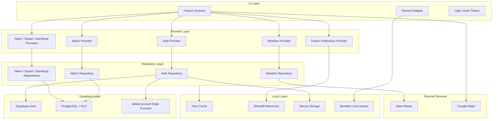

# ARCA TRİBÜN Mimari Yapısı

## Katmanlar

## Sorumluluk Dağılımı

| Katman | Sorumluluk |
| --- | --- |
| UI | Ekranlar, tema uyumu, loading/empty/error durumları |
| Provider | Riverpod üzerinden state üretimi ve bağımlılık bağlantısı |
| Repository | Supabase sorguları, fallback ve veri dönüşümü |
| Supabase | Auth, PostgreSQL, RLS, view ve Edge Function sözleşmeleri |
| Local | Cache, tercih, secure storage ve paketlenmiş asset yönetimi |

## Önemli Kararlar

- UI doğrudan Supabase istemcisine bağlanmaz; repository katmanı kullanılır.
- Pilot fallback verisi production davranışının yerine geçmez; yalnızca kontrollü
  demo modunda devreye girer.
- Oyuncu fotoğrafları çalışma anında dış URL üzerinden çekilmez.
- `service_role` anahtarı mobil istemciye girmez; hesap silme işlemi Edge
  Function sınırında yürütülür.
- Hava durumu ve bağlantı hataları kullanıcı akışını kırmadan fallback mesajına
  dönüşür.
